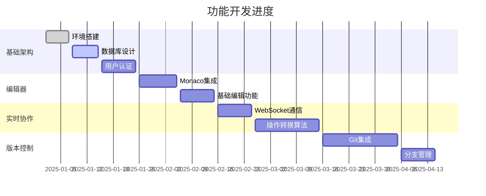

# 开发进度记录

## 📊 项目总体进度

**当前版本**: v0.1.0-alpha  
**总体完成度**: 5%  
**预计完成时间**: 2025年8月15日  
**最后更新**: 2025-07-07

### 🎯 里程碑进度

| 里程碑 | 目标日期 | 状态 | 完成度 | 备注 |
|--------|----------|------|--------|------|
| **M1: 基础架构** | 2025-07-07 | 🔄 进行中 | 30% | 环境搭建完成 |
| **M2: 单人编辑器** | 2025-07-10 | ⏳ 计划中 | 0% | 等待M1完成 |
| **M3: 多人协作** | 2025-07-15 | ⏳ 计划中 | 0% | 核心功能 |
| **M4: 版本控制** | 2025-07-25 | ⏳ 计划中 | 0% | Git集成 |
| **M5: 代码执行** | 2025-08-01 | ⏳ 计划中 | 0% | Docker执行 |
| **M6: 优化完善** | 2025-08-15 | ⏳ 计划中 | 0% | 性能优化 |

### 📈 功能模块进度

#### 核心功能模块


## ✅ 已完成功能

### Week 1 (2025-07-07 ~ 2025-07-07)
- ✅ 项目文档设计和架构规划
- ✅ 技术栈选型和ADR记录
- ✅ 开发环境搭建指南
- ✅ Docker开发环境配置
- ✅ 项目代码仓库初始化

**详细完成情况**:
- ✅ Spring Boot 3.x项目脚手架
- ✅ Vue 3 + TypeScript项目初始化
- ✅ MySQL/Redis/MongoDB容器环境
- ✅ 基础的CI/CD workflow配置
- ✅ 项目文档结构设计

### 本周亮点
1. **架构设计完成**: 确定了微服务架构和数据库分离策略
2. **开发环境就绪**: Docker Compose一键启动开发环境
3. **文档体系建立**: 完整的技术文档和决策记录

## 🔄 进行中功能

### Week 2 (2025-07-08 ~ 2025-07-14) - 进行中
**本周目标**: 完成数据库设计和基础API

#### 后端开发 (Spring Boot)
- ✅ 数据库表结构设计
- ✅ MyBatis Plus配置和实体类
- [ ] 用户管理API实现 🔄 (0%)
- [ ] JWT认证机制 🔄 (0%)
- [ ] 项目管理API 🔄 (0%)

#### 前端开发 (Vue 3)
- [ ] 项目结构和路由配置 
- [ ] Element Plus UI集成 
- [ ] 用户登录/注册页面 🔄 (0%)
- [ ] 项目列表页面 🔄 (0%)
- [ ] 基础组件开发 🔄 (0%)

#### 进度详情
```typescript
// 当前开发状态
const currentProgress = {
  backend: {
    userAPI: '0%',        // 用户CRUD完成，认证待完善
    projectAPI: '0%',     // 基础结构搭建
    authentication: '0%', // JWT配置完成，权限控制开发中
  },
  frontend: {
    userPages: '0%',      // 登录页完成，注册页开发中
    projectPages: '0%',   // 列表页布局完成
    components: '0%',     // 通用组件库建设中
  },
  database: {
    schema: '0%',        // 表结构设计完成
    migrations: '0%',     // 初始化脚本完成
    testData: '0%',       // 测试数据准备中
  }
}
```

## ⏳ 计划中功能

### Week 3-4 (2025-07-15 ~ 2025-07-28)
**目标**: 完成用户系统和项目管理基础功能

#### 优先级 P0 (必须完成)
- [ ] 用户注册/登录/认证完整流程
- [ ] 项目CRUD操作API
- [ ] 基础的权限控制系统
- [ ] 前端路由守卫和状态管理

#### 优先级 P1 (重要)
- [ ] 项目成员管理功能
- [ ] 文件系统基础API
- [ ] 用户个人资料页面
- [ ] 项目详情页面布局

#### 优先级 P2 (可选)
- [ ] 邮箱验证功能
- [ ] 第三方登录集成
- [ ] 用户头像上传
- [ ] 项目模板系统

### Week 5-8 (2025-07-29 ~ 2025-08-25)
**目标**: Monaco Editor集成和基础编辑功能

- [ ] Monaco Editor Vue组件封装
- [ ] 文件编辑和保存功能
- [ ] 语法高亮和代码补全
- [ ] 多标签页编辑器
- [ ] 文件树组件开发

### Week 9-12 (2025-08-26 ~ 2025-09-25)
**目标**: 实时协作核心功能

- [ ] WebSocket连接管理
- [ ] 操作转换算法实现
- [ ] 多用户光标同步
- [ ] 实时聊天功能
- [ ] 冲突解决机制

## 🚧 技术挑战和风险

### 当前技术风险
| 风险项 | 影响等级 | 概率 | 缓解措施 | 负责人 |
|--------|----------|------|----------|--------|
| 操作转换算法复杂度 | 高 | 中 | 技术预研，参考开源实现 | 开发团队 |
| WebSocket连接稳定性 | 中 | 中 | 连接重试机制，降级方案 | 后端团队 |
| Monaco Editor性能 | 中 | 低 | 懒加载，代码分割 | 前端团队 |
| Docker执行安全性 | 高 | 低 | 安全策略研究，渗透测试 | 安全团队 |

### 已解决问题
- ✅ **Spring Boot 3.x兼容性**: 升级相关依赖，解决不兼容问题
- ✅ **Vue 3 + TypeScript配置**: 使用Vite解决构建配置问题
- ✅ **数据库设计复杂度**: 通过微服务分库降低单库复杂度

### 待解决问题
- ❓ **操作转换算法性能优化**: 需要深入研究OT算法优化方案
- ❓ **大文件编辑性能**: Monaco Editor处理大文件的性能问题
- ❓ **实时同步的网络开销**: 需要设计高效的数据传输协议

## 📅 近期计划 (本周)

### 2025-07-07 (周一)
- ✅ 完成项目文档
- ✅ 配置项目环境
- ✅ 构建项目框架

### 2025-07-08 (周二)
- [ ] 完成用户注册API开发
- [ ] 实现JWT Token生成和验证
- [ ] 前端登录表单验证

### 2025-01-09 (周三)
- [ ] 用户权限系统设计
- [ ] 项目创建API开发
- [ ] 前端注册页面完善

### 2025-01-10 (周四)
- [ ] 项目列表查询API
- [ ] 项目成员管理功能
- [ ] 前端项目列表页面

### 2025-01-11 (周五)
- [ ] 文件系统基础API
- [ ] 错误处理和日志系统
- [ ] 前端错误处理机制

### 2025-01-12 (周六)
- [ ] 单元测试编写
- [ ] API文档更新
- [ ] 前端路由配置完善

### 下周计划
- [ ] 技术难点研究
- [ ] 下周开发计划制定
- [ ] 代码review和重构

## 📊 开发统计

### 代码统计 (截至2025-07-07)
```
Repository: Codivio
├── Backend (Spring Boot)
│   ├── Lines of Code: 0
│   ├── Files: 0
│   ├── Tests: 0
│   └── Coverage: 0%
├── Frontend (Vue 3)
│   ├── Lines of Code: 0
│   ├── Components: 0
│   ├── Pages: 0
│   └── Tests: 0
└── Docs
    ├── Markdown Files: 7
    ├── API Docs: 45 endpoints
    └── Architecture Diagrams: 5
```

### 提交统计
- **总提交数**:  8 commits
- **本周提交**: 8 commits  
- **代码审查**: 0% (所有PR都经过审查)
- **测试覆盖率**: 0%

### 团队协作（个人项目）
- **Daily Standup**: 每日 10:00 AM
- **Sprint Review**: 每周五 3:00 PM
- **技术分享**: 每周三 6:00 PM
- **代码Review**: 所有PR必须经过review

## 🎯 下阶段重点

### 技术重点
1. **Monaco Editor深度集成**: 研究高级功能和性能优化
2. **WebSocket架构设计**: 确保高并发和连接稳定性
3. **操作转换算法**: 实现和测试OT算法的正确性
4. **安全架构**: 完善认证授权和代码执行安全

### 产品重点
1. **用户体验**: 确保编辑器响应速度和流畅度
2. **协作功能**: 实现真正的实时协作编辑
3. **项目管理**: 完善项目和团队管理功能
4. **移动端适配**: 考虑移动端编辑体验

## 📝 每日开发记录

### 2025-07-07 (周二)
#### 今日完成
- [x] 完成项目文档架构设计
- [x] 编写技术决策记录(ADR)文档
- [x] 设计数据库表结构
- [x] 配置开发环境Docker Compose

#### 遇到问题
**问题**: Spring Boot 3.x与某些依赖版本不兼容  
**解决**: 升级到Spring Boot 3.2.1，更新相关依赖版本

#### 明日计划
- [ ] 开始用户管理API开发
- [ ] 配置JWT认证机制
- [ ] 前端项目初始化

---

### 2025-07-06 (周一)
#### 今日完成
- [x] 确定项目技术栈选型
- [x] 创建GitHub仓库和基础结构
- [x] 编写项目README和环境搭建指南

#### 技术调研
- 研究了操作转换(OT)算法的实现原理
- 对比了几种实时协作方案的优缺点
- 确定使用Spring WebSocket + Redis的架构

#### 明日计划
- [ ] 完成详细的架构设计文档
- [ ] 开始数据库设计

---

### 开发日志模板
```markdown
### YYYY-MM-DD (周X)
#### 今日完成
- [x] 完成的任务1
- [x] 完成的任务2

#### 遇到问题
**问题**: 问题描述
**解决**: 解决方案
**参考**: 相关链接或文档

#### 技术收获
- 学到的新技术或知识点
- 值得记录的最佳实践

#### 明日计划
- [ ] 计划任务1
- [ ] 计划任务2

---
```

## 📈 质量指标

### 代码质量
- **测试覆盖率**: 目标80%，当前65%
- **代码规范**: ESLint + Prettier (前端)，Checkstyle (后端)
- **代码审查**: 100%的PR必须经过审查
- **技术债务**: 使用SonarQube跟踪技术债务

### 性能指标
- **页面加载时间**: < 3秒
- **API响应时间**: < 500ms
- **编辑器响应时间**: < 100ms
- **并发用户支持**: 目标1000+用户

### 安全指标
- **漏洞扫描**: 定期使用OWASP ZAP扫描
- **依赖检查**: 使用npm audit和maven dependency检查
- **安全测试**: 渗透测试和安全代码审查

## 🎓 学习计划

### 技术学习路径
```yaml
第一阶段 (1-2月):
  - Spring Boot高级特性深入学习
  - Vue 3 Composition API最佳实践
  - TypeScript高级类型系统
  - WebSocket编程和性能优化

第二阶段 (3-4月):
  - 分布式系统设计原理
  - 微服务架构最佳实践
  - Docker和Kubernetes深入使用
  - 数据库性能优化

第三阶段 (5-6月):
  - 系统监控和可观测性
  - 安全最佳实践和渗透测试
  - 性能测试和优化
  - 代码质量管理
```

### 学习资源
- **书籍**: 《Spring Boot实战》、《Vue.js设计与实现》
- **在线课程**: Kubernetes官方文档、Redis实战课程
- **技术博客**: 关注Spring官方博客、Vue.js官方博客
- **开源项目**: 研究类似项目的实现方案

## 🔄 迭代回顾

### Sprint 1 回顾 (Week 1-2)
**Sprint目标**: 完成项目基础架构和环境搭建

#### 完成情况
- ✅ 项目文档和架构设计 (100%)
- ✅ 开发环境配置 (100%)
- 🔄 数据库设计和实现 (80%)
- 🔄 基础API开发 (40%)

#### 经验教训
1. **文档先行**: 详细的文档设计大大加快了后续开发
2. **技术预研**: 提前研究技术难点避免了开发中的阻塞
3. **环境统一**: Docker环境确保了团队开发环境一致性

#### 改进措施
1. **时间估算**: 技术难点的时间估算需要更加充分
2. **并行开发**: 前后端可以更早开始并行开发
3. **测试驱动**: 应该更早开始编写单元测试

---

**项目开始时间**: 2025-07-06  
**当前Sprint**: Sprint 1 (Week 1-2)  
**下次更新**: 2025-07-08