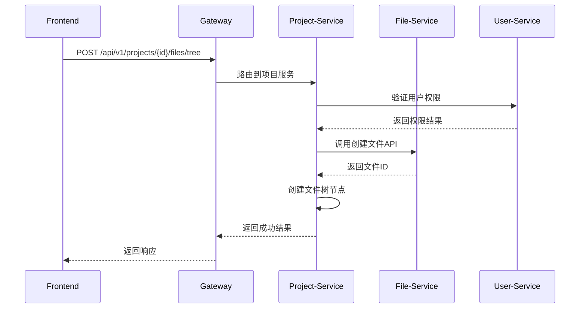
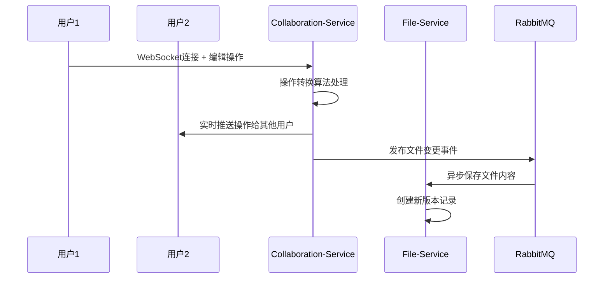

# Codivio 应用场景示例

## 🎯 业务场景概述

本文档通过具体的应用场景，展示 Codivio 分布式实时代码协作平台的业务流程和微服务间的协作模式，帮助理解系统架构的实际运用。

## 📋 核心业务流程

### 场景1：团队项目创建与协作

#### 背景
张三是一个前端开发团队的技术负责人，需要创建一个新的React项目，并邀请李四（后端开发）和王五（UI设计师）一起协作开发。

#### 完整业务流程

##### 1. 用户注册与登录
```yaml
参与者: 张三、李四、王五
服务调用流程:
  Frontend → Gateway → User-Service
  
具体步骤:
  1. 张三访问 https://codivio.dev/register
  2. 填写用户信息提交注册
  3. User-Service 验证信息并创建用户记录
  4. 返回JWT令牌，完成登录
  5. 李四、王五重复相同流程完成注册
```

**技术实现**：
```http
POST /api/v1/auth/register
{
  "username": "zhangsan",
  "email": "zhangsan@company.com",
  "password": "SecurePass123!",
  "nickname": "张三"
}

Response:
{
  "code": 201,
  "message": "注册成功",
  "data": {
    "userId": 12345,
    "username": "zhangsan",
    "accessToken": "eyJhbGciOiJIUzI1NiIsInR5cCI6IkpXVCJ9..."
  }
}
```

##### 2. 创建项目
```yaml
操作者: 张三
服务调用流程:
  Frontend → Gateway → Project-Service → File-Service
  
具体步骤:
  1. 张三登录后访问项目创建页面
  2. 填写项目信息：名称、描述、技术栈
  3. Project-Service 创建项目记录
  4. 自动调用 File-Service 创建项目根目录
  5. 返回项目信息和默认文件结构
```

**技术实现**：
```http
POST /api/v1/projects
Authorization: Bearer <zhang_san_token>
{
  "name": "电商移动端项目",
  "description": "基于React Native的电商移动端应用",
  "language": "javascript"
}

Response:
{
  "code": 201,
  "message": "项目创建成功",
  "data": {
    "projectId": "proj_ecommerce_2024",
    "name": "电商移动端项目",
    "owner": {
      "userId": 12345,
      "username": "zhangsan"
    },
    "fileTree": {
      "src/": "directory",
      "src/components/": "directory",
      "package.json": "file",
      "README.md": "file"
    }
  }
}
```

##### 3. 邀请团队成员
```yaml
操作者: 张三
服务调用流程:
  Frontend → Gateway → Project-Service → User-Service (验证用户)
  
具体步骤:
  1. 张三在项目设置中点击"邀请成员"
  2. 输入李四和王五的用户名
  3. Project-Service 验证用户存在性
  4. 发送邀请并分配角色权限
  5. 被邀请用户收到通知并加入项目
```

**技术实现**：
```http
POST /api/v1/projects/proj_ecommerce_2024/members
{
  "username": "lisi",
  "role": "editor"
}

POST /api/v1/projects/proj_ecommerce_2024/members
{
  "username": "wangwu", 
  "role": "viewer"
}
```

##### 4. 协作编辑代码
```yaml
参与者: 张三、李四同时编辑
服务调用流程:
  Frontend → WebSocket → Collaboration-Service → File-Service
  
具体步骤:
  1. 张三打开 src/App.js 文件进行编辑
  2. Collaboration-Service 建立WebSocket连接
  3. 李四也打开同一文件，看到张三的光标位置
  4. 两人同时编辑，操作转换算法解决冲突
  5. File-Service 实时保存文件版本
```

**技术实现**：
```javascript
// WebSocket 连接建立
const ws = new WebSocket('wss://codivio.dev/ws/editor');

// 加入文档编辑
ws.send(JSON.stringify({
  type: 'join-document',
  data: {
    projectId: 'proj_ecommerce_2024',
    filePath: '/src/App.js',
    userId: 12345
  }
}));

// 发送编辑操作
ws.send(JSON.stringify({
  type: 'operation',
  data: {
    operation: {
      type: 'insert',
      position: 100,
      text: 'const handleLogin = () => {',
      userId: 12345
    }
  }
}));
```

---

### 场景2：多人实时协作解决Bug

#### 背景
项目上线后发现一个紧急Bug，张三、李四需要同时查看代码并快速修复。

#### 业务流程

##### 1. 紧急Bug定位
```yaml
场景描述:
  - 用户反馈登录功能异常
  - 张三负责前端排查，李四负责后端API
  - 需要同时查看和修改多个文件

服务协作:
  Project-Service: 管理文件权限和结构
  File-Service: 提供文件内容和版本管理
  Collaboration-Service: 实时同步编辑状态
```

##### 2. 实时协作流程
```yaml
时间轴协作过程:
  10:00 - 张三打开前端登录组件文件
  10:01 - 李四加入编辑，查看API调用代码  
  10:02 - 张三发现API调用路径错误
  10:03 - 李四同时在后端修改API接口
  10:05 - 两人通过内置聊天功能讨论方案
  10:10 - 协作完成修复，创建新版本
```

**实时协作技术实现**：
```json
// 张三看到李四的光标位置
{
  "type": "user-cursor",
  "data": {
    "userId": 67890,
    "username": "lisi", 
    "cursorPosition": 150,
    "selection": {
      "start": 150,
      "end": 180
    },
    "cursorColor": "#42b883"
  }
}

// 操作转换冲突解决
{
  "type": "operation-transformed",
  "data": {
    "originalOp": {
      "type": "insert",
      "position": 100,
      "text": "// Bug fix: "
    },
    "transformedOp": {
      "type": "insert", 
      "position": 105,  // 位置自动调整
      "text": "// Bug fix: "
    }
  }
}
```

---

### 场景3：项目文件管理与版本控制

#### 背景
随着项目开发进展，需要管理大量的代码文件、图片资源、文档等，同时需要版本控制。

#### 业务流程

##### 1. 文件上传与组织
```yaml
操作场景:
  - 王五上传UI设计稿到项目
  - 张三创建新的组件文件
  - 李四上传API文档

服务分工:
  Project-Service: 管理文件树结构和权限
  File-Service: 处理文件存储和元数据
  User-Service: 验证用户权限
```

**技术实现**：
```http
# 王五上传设计稿
POST /api/v1/files/upload
Content-Type: multipart/form-data
{
  "file": <design_mockup.png>,
  "projectId": "proj_ecommerce_2024", 
  "path": "/assets/designs/",
  "description": "首页设计稿v2.0"
}

# 同时在项目服务中创建文件树节点
POST /api/v1/projects/proj_ecommerce_2024/files/tree
{
  "path": "/assets/designs/homepage_v2.png",
  "type": "file",
  "fileId": "file_design_001"
}
```

##### 2. 版本管理流程
```yaml
版本控制场景:
  - 张三修改了关键组件，需要保存版本
  - 李四回滚到之前的API版本
  - 系统自动记录每次修改的作者和时间

技术实现:
  - File-Service 管理版本历史
  - 每次保存自动创建新版本
  - 支持版本对比和回滚
```

**版本管理技术实现**：
```http
# 查看文件版本历史
GET /api/v1/files/file_component_001/versions

Response:
{
  "code": 200,
  "data": {
    "versions": [
      {
        "version": 3,
        "changedBy": "zhangsan",
        "changeComment": "修复登录按钮样式问题",
        "createdAt": "2024-01-15T14:30:00Z"
      },
      {
        "version": 2, 
        "changedBy": "lisi",
        "changeComment": "添加错误处理逻辑",
        "createdAt": "2024-01-15T10:20:00Z"
      }
    ]
  }
}

# 回滚到指定版本
POST /api/v1/files/file_component_001/rollback
{
  "targetVersion": 2,
  "comment": "回滚到稳定版本"
}
```

---

## 🔄 微服务协作模式

### 数据流转示例

#### 创建文件的完整流程


#### 实时协作的技术流程


---

## 💡 业务价值体现

### 解决的实际问题

1. **远程协作难题**
   - 传统方式：文件冲突、版本混乱、沟通成本高
   - Codivio方案：实时同步、自动合并、即时沟通

2. **项目管理复杂性**
   - 传统方式：文件散乱、权限不清、历史难追溯
   - Codivio方案：结构化管理、细粒度权限、完整版本历史

3. **团队协作效率**
   - 传统方式：异步协作、反馈滞后、知识孤岛
   - Codivio方案：实时协作、即时反馈、知识共享

### 技术架构优势

1. **微服务架构**
   - 职责清晰，便于维护和扩展
   - 服务独立部署，提高系统可用性
   - 技术栈灵活，适合团队技能分工

2. **实时通信**
   - WebSocket长连接，毫秒级响应
   - 操作转换算法，智能冲突解决
   - 事件驱动架构，数据一致性保证

3. **容器化部署**
   - 环境一致性，降低部署风险
   - 弹性扩容，应对业务增长
   - 微服务编排，简化运维管理

---

## 🎯 面试展示要点

当面试官问到项目细节时，可以通过这些场景展示：

### 架构设计能力
```yaml
展示重点:
  - "我设计了5个微服务，每个服务职责单一明确"
  - "通过Gateway统一入口，实现了负载均衡和统一认证"
  - "使用事件驱动保证分布式数据一致性"

技术亮点:
  - 微服务边界清晰，符合DDD设计
  - API版本管理，支持平滑升级
  - 容器化部署，支持弹性扩容
```

### 实际问题解决
```yaml
业务理解:
  - "解决了远程团队实时协作的痛点"
  - "通过操作转换算法解决并发编辑冲突"
  - "实现了细粒度的权限控制和文件管理"

技术深度:
  - WebSocket + 操作转换算法
  - 分布式系统数据一致性
  - 高并发场景下的性能优化
```

### 项目完整性
```yaml
全栈能力:
  - 前端: Vue3 + TypeScript + Monaco Editor
  - 后端: Spring Boot + 微服务架构
  - 数据: MySQL + Redis + RabbitMQ
  - 运维: Docker + 监控 + 日志

工程化:
  - 完整的文档体系
  - 标准化的开发流程
  - 可观测性设计
```

通过这些具体场景，能够清晰地展示系统的业务价值和技术深度，帮助面试官理解项目的复杂性和你的技术能力。